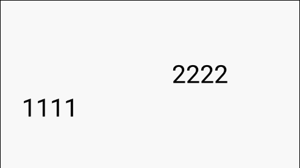

## MarqueeTextView
[](https://android-arsenal.com/api?level=14) [](https://jitpack.io/#iMeiji/SetupWizardLayout)

单行文本跑马灯控件，支持设置文字滚动速度、滚动方向、点击暂停滚动。

## Screenshots


## Download

### Gradle

Step 1. Add the JitPack repository to your build file
```
allprojects {
    repositories {
        ...
        maven { url 'https://jitpack.io' }
    }
}
```
Step 2. Add the dependency
```
dependencies {
    implementation 'com.github.iMeiji:MarqueeTextView:0.1'
}
```

### Maven
Step 1. Add the JitPack repository to your build file
```
<repositories>
    <repository>
        <id>jitpack.io</id>
        <url>https://jitpack.io</url>
    </repository>
</repositories>
```
Step 2. Add the dependency
```
<dependency>
    <groupId>com.github.iMeiji</groupId>
    <artifactId>MarqueeTextView</artifactId>
    <version>0.1</version>
</dependency>
```

## Usage

`Activity.java`  
```java
tv.setText(new String[]{"11111111111", "2222", "3333333"})
                .setStep(4)
                .setOrientation(MarqueeTextView.TOLEFT)
                .create()
                .startScroll();

tv2.setText(new String[]{"1111", "2222222222222222", "3333"})
                .setStep(5)
                .setOrientation(MarqueeTextView.TORIGHT)
                .setOnClickable(true)
                .create()
                .startScroll();
```

`layout.xml`  
```xml
<com.meiji.library.MarqueeTextView
        android:id="@+id/tv"
        android:layout_width="0dp"
        android:layout_height="wrap_content"
        android:textSize="32sp"/>
```

